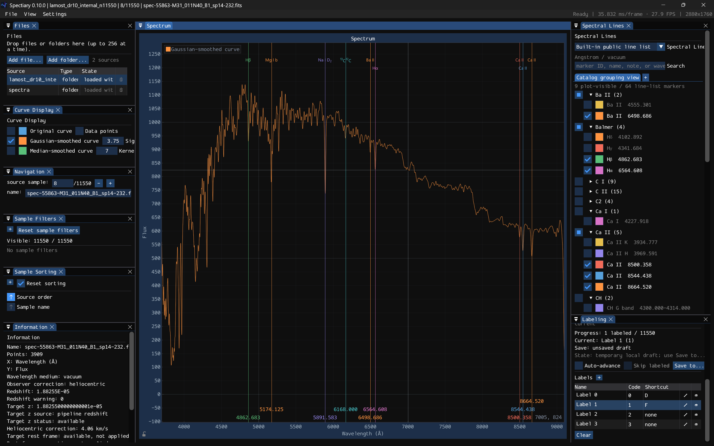

  

<h1 align="center">Spectiary</h1>

  
  
  
  
  

  <strong>Lightweight. Fast. Fluid.</strong> 
  A native Windows spectrum viewer for fast, focused inspection of astronomical spectra.

<em>Pronounced /ˈspɛk.tiˌɛr.i/.</em>

Spectiary is a focused desktop tool for opening local astronomical spectra, moving rapidly through observations, zooming into features, and comparing them with spectral references. It keeps the main plot at the center of the workflow and treats interaction latency as a product requirement rather than trading responsiveness for a broader application stack.

> [!NOTE]
> Spectiary is currently **pre-1.0 and under active development**. The core viewing workflow is usable today, while FITS coverage and higher-level analysis workflows are still evolving.

## Why Spectiary

### Lightweight

Spectiary is a native **C++20** Windows application built directly on Win32 and DirectX 11. It does not require a browser runtime or a Python runtime to inspect spectra, and it avoids a large cross-platform UI framework in the interaction path.

Its render policy is event-driven: when nothing is changing, the application does not keep redrawing just to look alive.

### Fast

Data loading, diagnostics, and other potentially expensive work stay away from the plot interaction path. Spectrum sources can load in the background, while the UI consumes stable spectrum snapshots rather than parsing files inside the renderer.

Performance work is validated with **real spectral data and recorded interaction timing**, not synthetic-only benchmark claims.

### Fluid

The plot is designed around direct manipulation. Mouse and Windows Precision Touchpad input support panning, cursor-centered zoom, axis-constrained gestures, wavelength and flux range navigation, and rapid previous/next spectrum switching for supported multi-spectrum sources.

On supported Windows 11 systems, Spectiary can integrate with **Dynamic Refresh Rate (DRR)** through the Windows compositor clock so active plot interaction can request a higher-refresh presentation path and return to the base rate afterwards.

## What You Can Do

- **Open LAMOST and SDSS FITS spectra** directly in a native desktop viewer.
- **Move rapidly through supported spectrum collections** and multi-spectrum FITS sources.
- **Open folders of spectra** for lightweight local review workflows.
- **Pan, zoom, and inspect features** with mouse or Precision Touchpad input.
- **Navigate wavelength and flux ranges** without losing the main plot as the primary workspace.
- **Search spectral references** and display line and band overlays directly on the plot.
- **Arrange the workspace freely** with dockable and detachable panels.
- **Enter an immersive plot view** with `F11` when the spectrum itself needs the full screen.
- **Record bounded performance diagnostics** when investigating interaction or presentation behavior.

## Supported Data

Spectiary's user-facing data path is centered on astronomical FITS spectra, with **LAMOST and SDSS as the primary compatibility targets**.

| Source | Current support |
| --- | --- |
| LAMOST FITS | Recognized single-spectrum table/image semantics and supported vector-table cases |
| SDSS FITS | Recognized SDSS-style table/image semantics and supported vector-table cases |
| Generic FITS | Restricted single-spectrum table/image semantics with explicit wavelength metadata |
| Folder of spectra | Non-recursive browsing of supported first-level FITS sources |

FITS is a broad ecosystem, so support is intentionally explicit rather than claiming that every FITS layout will work. A single CFITSIO reader parses both table and image containers; the spectrum semantics layer then recognizes only the restricted LAMOST, SDSS, and generic single-spectrum structures described by the format contract. Opening a container is not itself a promise that Spectiary can interpret it as a spectrum.

For `.fits.gz`, Spectiary first performs bounded transport decompression and then gives the resulting FITS bytes to that same CFITSIO reader. FITS network URLs and FITS writing are not supported.

Spectiary also has `.npy` and simple wavelength/flux `.csv` input paths for project-specific datasets, development, testing, and conversion workflows. They are useful implementation contracts, but they are **not the formats that define the public-facing product**.

For exact loader and data-boundary behavior, see the [Spectrum Snapshot Contract](docs/reference/spectra/spectrum_snapshot_contract.md).

## Workspace and Interaction

The main spectrum plot is the first visual layer. Supporting tools live in ordinary dockable panels, so the workspace can be rearranged without replacing the plotting surface with a custom window-management system.

Panels can be docked, undocked, and restored through the Dear ImGui docking layout. Detached panels use native Windows viewports, while `F11` provides a dedicated immersive plot presentation for focused inspection.

The Spectral Lines panel can search and organize the built-in public spectral references and render line or band overlays on the main plot. You can also open your own [canonical JSON line list](docs/reference/spectral-lines/spectral_line_list_v1.md). The current downstream plot path supports laboratory/rest **vacuum Angstrom** coordinates; other coordinate semantics remain inspectable but show a diagnostic and suppress the overlay.

## Platform

- **Windows 10 or Windows 11**
- **64-bit Windows on x64 hardware**
- Official releases are provided for x64 only
- Windows 11 adds optional compositor-clock DRR boosting on supported systems
- Windows Precision Touchpad gestures use the native Windows Direct Manipulation path

The presentation path uses modern DXGI flip-model behavior and does not target Windows versions older than Windows 10.

## Development

README is intentionally kept user-facing. Build configuration, implementation contracts, profiling details, automation interfaces, and packaging rules live in the documentation instead.

Start with the [documentation index](docs/README.md), or go directly to:

- [Engineering setup](docs/development/engineering_setup.md) — toolchain, configuration and supported build commands
- [Product requirements](docs/product_requirements.md) and [technical direction](docs/technical_direction.md) — goals, behavior and architecture
- [Domain reference](docs/reference/README.md) — spectrum, sample-labeling and spectral-line contracts
- [Testing](docs/testing/README.md) — widget, automation and real-data performance validation
- [Presentation](docs/presentation/README.md) — display policy, telemetry and window resizing
- [Release artifacts](docs/development/release_artifacts.md) — portable packaging and metadata contracts

The current native stack uses:

- **C++20** for the application and domain layer
- **Win32** for native Windows integration
- **DirectX 11 / DXGI flip model** for presentation
- **Dear ImGui docking branch** for a flexible desktop workspace
- **ImPlot** for interactive spectrum plotting
- **Windows Direct Manipulation** for native Precision Touchpad gestures
- **Windows 11 compositor clock / DRR integration** for high-refresh interaction where supported
- **CMake + vcpkg** for reproducible project configuration and dependency management

Building from source requires Visual Studio 2022 Build Tools, a Windows 10/11 SDK, CMake 3.24 or newer, and vcpkg. Ninja is optional. See [Engineering setup](docs/development/engineering_setup.md) for the supported commands rather than invoking the Ninja/MSVC build path ad hoc.

## License

Spectiary is licensed under the [MIT License](LICENSE).

Third-party software and data remain under their respective licenses; see [third-party software notices](legal/THIRD_PARTY_NOTICES.txt) and [data source notices](legal/DATA_SOURCES.txt).
