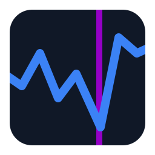

  

<h1 align="center">SpecForge</h1>

  <strong>Lightweight. Fast. Fluid.</strong> 
  A native Windows spectrum viewer for focused, high-refresh exploration of astronomical spectra.

SpecForge is built for the part of spectral analysis that happens with your eyes and hands: opening local datasets, moving rapidly through spectra, zooming into features, and comparing them with spectral references without carrying a heavy application stack along for the ride.

It is designed as a focused desktop tool rather than a general scientific platform. The main plot stays at the center of the experience, interaction latency is treated as a product requirement, and features are expected to preserve the responsiveness of pan, zoom, navigation, and spectrum switching.

> [!NOTE]
> SpecForge is currently **pre-1.0 and under active development**. The core viewing workflow is usable today, while format coverage and higher-level analysis workflows are still evolving.

## Why SpecForge

### Lightweight

SpecForge is a native **C++20** Windows application built directly on Win32 and DirectX 11. It does not require a browser runtime or a Python runtime to view spectra, and it avoids a large cross-platform UI framework in the hot path.

The application also uses an event-driven render policy: when nothing is changing, it does not keep redrawing just to look alive.

### Fast

The architecture keeps data loading, diagnostics, and other potentially expensive work away from the plot interaction path. Source collections can load in the background, while the UI consumes stable spectrum snapshots rather than parsing files inside the renderer.

Performance work is validated with **real spectral data and recorded interaction timing**, not synthetic-only benchmark claims.

### Fluid

The main plot is designed around direct manipulation:

- drag to pan
- cursor-centered wheel zoom
- Windows Precision Touchpad two-finger pan and pinch zoom
- axis-constrained touchpad gestures when starting over an axis
- wavelength and flux range navigation
- fast previous/next spectrum switching for multi-spectrum sources

On supported Windows 11 systems, SpecForge can integrate with **Dynamic Refresh Rate (DRR)** through the Windows compositor clock so active plot interaction can request a higher-refresh presentation path and return to the base rate afterwards.

## What You Can Do

- **Open real spectrum data** from `.npy`, simple wavelength/flux `.csv`, and supported FITS sources.
- **Browse collections quickly**, including rows in spectrum matrices and supported multi-spectrum FITS data.
- **Open folders of spectra** for lightweight local review workflows.
- **Pan, zoom, and inspect features** with mouse or Precision Touchpad input.
- **Navigate wavelength and flux ranges** without losing the main plot as the primary workspace.
- **Search spectral references** and display line and band overlays directly on the plot.
- **Arrange the workspace freely** with dockable and detachable panels.
- **Enter an immersive plot view** with `F11` when the spectrum itself needs the full screen.
- **Record bounded performance diagnostics** when investigating interaction or presentation behavior.

## Designed For

SpecForge is especially suited to workflows such as:

- visually inspecting **LAMOST, SDSS, and similar astronomical spectra**
- rapidly reviewing many spectra for quality control or candidate triage
- zooming into local wavelength regions and comparing features with reference lines or bands
- long desktop inspection sessions where low interaction latency and high information density matter
- high-refresh Windows desktops and laptops where the plotting surface should feel as direct as the rest of the system

## Spectrum Sources

Current source support is intentionally focused rather than pretending to be a universal astronomy file reader.

| Source | Current support |
| --- | --- |
| `.npy` | 1D spectra and row-oriented 2D float32/float64 spectrum matrices |
| `.csv` | Simple wavelength/flux spectra |
| FITS | Recognized LAMOST/SDSS-style table spectra, including supported multi-spectrum vector-table cases |
| Folder | Non-recursive collections of supported CSV/FITS files |

A 3909-column `.npy` matrix uses SpecForge's fixed log-wavelength grid; other widths fall back to pixel index with diagnostics. FITS image handling remains a narrow compatibility fallback and should **not** be read as generic FITS support.

For the exact data contract, see [Spectrum Snapshot Contract](docs/spectrum_snapshot_contract.md).

## A Native, Performance-First Stack

SpecForge deliberately uses a small native stack:

- **C++20** for the application and domain layer
- **Win32** for native Windows integration
- **DirectX 11 / DXGI flip model** for presentation
- **Dear ImGui docking branch** for a flexible desktop workspace
- **ImPlot** for interactive spectrum plotting
- **Windows Direct Manipulation** for native Precision Touchpad gestures
- **Windows 11 compositor clock / DRR integration** for high-refresh interaction where supported
- **CMake + vcpkg** for reproducible project configuration and dependency management

This stack is not an abstraction exercise. It is chosen to keep the path from input to plot update to presentation short, observable, and maintainable.

## Workspace and Interaction

The main spectrum plot is the first visual layer. Supporting tools live in ordinary dockable panels, so the workspace can be rearranged without replacing the plotting surface with a custom window-management system.

Panels can be docked, undocked, and restored through the Dear ImGui docking layout. Detached panels use native Windows viewports, while `F11` provides a dedicated immersive plot presentation for focused inspection.

Spectral references come from the tracked public catalog in [`config/spectral_lines.public.tsv`](config/spectral_lines.public.tsv). The Spectral Lines panel can search and organize those references and render line or band overlays on the main plot.

## Platform

- **Windows 10 or Windows 11**
- x64 is the primary target
- Windows 11 adds optional compositor-clock DRR boosting on supported systems
- Windows Precision Touchpad gestures use the native Windows Direct Manipulation path

The presentation path uses modern DXGI flip-model behavior and does not target Windows versions older than Windows 10.

## Development

README is intentionally kept user-facing. Build configuration, implementation contracts, profiling details, automation interfaces, and packaging rules live in the documentation instead.

Start here if you want to build or work on SpecForge:

- [Engineering setup](docs/engineering_setup.md) — toolchain, vcpkg, CMake presets, build and test guidance
- [Technical direction](docs/technical_direction.md) — architecture and performance constraints
- [Product requirements](docs/product_requirements.md) — product goals, workflows, milestones, and non-goals
- [Performance testing](docs/performance_testing.md) — real-data interaction profiling
- [Release artifacts](docs/release_artifacts.md) — portable packaging, metadata, hashes, and release contracts
- [Automation control](docs/automation_control.md) — test/debug automation interface
- [Spectral line catalog contract](docs/spectral_line_catalog_contract.md) — public reference data rules

The current native stack requires Visual Studio 2022 Build Tools, a Windows 10/11 SDK, CMake 3.24 or newer, and vcpkg. Ninja is optional. See [Engineering setup](docs/engineering_setup.md) for the supported commands rather than invoking the Ninja/MSVC build path ad hoc.

---

  <strong>SpecForge is about one thing first: making spectrum inspection feel light, fast, and fluid.</strong>

